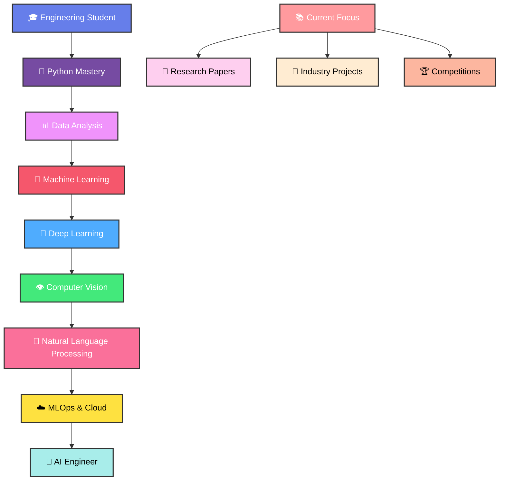

<div align="center">
  
</div>

<div align="center">
  
</div>

<!-- Matrix-style animated border -->
<div align="center">
  
</div>

## 🐍 Snake Game - Devouring My GitHub Contributions!

<div align="center">
  <picture>
    <source media="(prefers-color-scheme: dark)" srcset="https://raw.githubusercontent.com/aadilshaikh123/aadilshaikh123/output/snake-dark.svg" />
    <source media="(prefers-color-scheme: light)" srcset="https://raw.githubusercontent.com/aadilshaikh123/aadilshaikh123/output/snake-light.svg" />
    
  </picture>
</div>

<div align="center">
  
  
</div>

## 🌊 Profile Wave

<div align="center">
  
</div>

<div align="center">
  
</div>

## 💫 About Me


```python
class DataScientist:
    def __init__(self):
        self.name = "Aadilnawaz Shaikh"
        self.role = "AI & Data Science Engineer"
        self.location = "Pune, India 🇮🇳"
        self.education = "Final Year Engineering Student"
        self.languages = ["Python", "SQL", "R", "JavaScript"]
        self.specialties = ["Machine Learning", "Deep Learning", "Data Analysis"]
        self.current_focus = "Building AI solutions that matter"
        self.coffee_consumed = float('inf')
        self.bugs_created = "Finite (I hope...)"
        self.bugs_fixed = "More than created (definitely!)"
        
    def get_philosophy(self):
        return "Data is the new oil, but insights are the refined fuel! ⛽"
        
    def daily_routine(self):
        return [
            "☕ Coffee.initialize()",
            "📊 data.analyze() and pattern.discover()", 
            "🤖 model.train() and accuracy.improve()",
            "💡 insights.generate() and stories.tell()",
            "🚀 solutions.deploy() and impact.create()",
            "📚 knowledge.expand() and skills.level_up()",
            "🎯 tomorrow.plan() and dreams.chase()"
        ]
    
    def get_current_status(self):
        return {
            "🎯": "Building the future with AI",
            "�": "Learning MLOps and Cloud Architecture",
            "🔧": "Experimenting with Computer Vision",
            "🌱": "Growing in the Data Science ecosystem"
        }

# Instance creation and status check
aadil = DataScientist()
print(f"🚀 Currently: {aadil.current_focus}")
print(f"☕ Coffee Status: {aadil.coffee_consumed}")
for emoji, status in aadil.get_current_status().items():
    print(f"{emoji} {status}")
```

<div align="center">
  
  
  
</div>

## 🛠️ Tech Arsenal & Skills

<div align="center">

### 🚀 Programming Languages
<div>
  
</div>


### 🧠 AI/ML Frameworks
<div>
  
</div>


### 📊 Data Tools & Analytics


### ⚡ Development Tools
<div>
  
</div>


### ☁️ Cloud & Deployment


</div>

<div align="center">
  
  
</div>

## 📊 GitHub Analytics Dashboard

<div align="center">
  
  
</div>

<div align="center">
  
</div>

<div align="center">
  
</div>

## 📈 Contribution Activity Graph

<div align="center">
  
</div>

## 🏆 GitHub Achievements & Trophies

<div align="center">
  
</div>

<div align="center">
  
</div>

## 🚀 Featured Projects & Portfolio

<div align="center">
  <table>
    <tr>
      <td width="50%">
        <h3 align="center">🤖 Machine Learning Projects</h3>
        <div align="center">
          <a href="https://github.com/aadilshaikh123/ml-project-1">
            
          </a>
          <br><br>
          <p><strong>🎯 Predictive Analytics</strong></p>
          <p>Advanced ML models for real-world predictions using ensemble methods and deep learning.</p>
        </div>
      </td>
      <td width="50%">
        <h3 align="center">📊 Data Analysis Projects</h3>
        <div align="center">
          <a href="https://github.com/aadilshaikh123/data-analysis-project">
            
          </a>
          <br><br>
          <p><strong>📈 Business Intelligence</strong></p>
          <p>Comprehensive data analysis with interactive visualizations and actionable insights.</p>
        </div>
      </td>
    </tr>
  </table>
</div>

<div align="center">
  
  
</div>

### 🎯 Project Highlights
- 🏥 **Healthcare Analytics**: Predictive models for patient outcomes
- 🏢 **Business Intelligence**: Sales forecasting and customer segmentation  
- 🔍 **Computer Vision**: Image classification and object detection
- 📱 **NLP Projects**: Sentiment analysis and text classification
- 🌐 **Web Scraping**: Automated data collection and analysis

## 🎯 Current Learning Journey & Roadmap

<div align="center">



</div>

<div align="center">
  <h3>🌟 2024 Learning Goals</h3>
  <table>
    <tr>
      <td align="center"><strong>🎯 Target</strong></td>
      <td align="center"><strong>📊 Progress</strong></td>
      <td align="center"><strong>🏆 Status</strong></td>
    </tr>
    <tr>
      <td>MLOps & Model Deployment</td>
      <td></td>
      <td>🔥 In Progress</td>
    </tr>
    <tr>
      <td>Computer Vision Projects</td>
      <td></td>
      <td>📚 Learning</td>
    </tr>
    <tr>
      <td>Cloud Architecture (AWS/GCP)</td>
      <td></td>
      <td>🌱 Growing</td>
    </tr>
    <tr>
      <td>Research Paper Publications</td>
      <td></td>
      <td>🔬 Researching</td>
    </tr>
  </table>
</div>

## 🎮 Fun Zone & Interactive Elements

<div align="center">

### 🐍 Watch the Snake Devour My GitHub Contributions!
*The snake above visualizes my GitHub activity pattern - watch it grow as I contribute more!*


### � Real-Time Activity


### 🎲 Random Developer Wisdom


### 🏃‍♂️ Coding Activity This Week
<!--START_SECTION:waka-->
```text
Python       12 hrs 30 mins  ████████████████▒░░░░   65.2%
Jupyter      4 hrs 15 mins   ████▒░░░░░░░░░░░░░░░░   22.1%
SQL          1 hr 45 mins    ██░░░░░░░░░░░░░░░░░░░    9.1%
Markdown     35 mins         ▒░░░░░░░░░░░░░░░░░░░░    3.1%
Other        5 mins          ░░░░░░░░░░░░░░░░░░░░░    0.5%
```
<!--END_SECTION:waka-->

</div>

## 🌟 Random Developer Quote

<div align="center">
  
</div>

## 🎵 Currently Vibing To

<div align="center">
  
</div>

## 🌐 Connect With Me & Let's Build Something Amazing!

<div align="center">

### 🤝 Let's Connect and Collaborate!

<table>
  <tr>
    <td align="center">
      <a href="https://linkedin.com/in/your-profile">
        
        <br><strong>Professional Network</strong>
      </a>
    </td>
    <td align="center">
      <a href="https://twitter.com/aadilwho">
        
        <br><strong>Tech Discussions</strong>
      </a>
    </td>
    <td align="center">
      <a href="your-portfolio-url">
        
        <br><strong>My Work</strong>
      </a>
    </td>
  </tr>
  <tr>
    <td align="center">
      <a href="mailto:your-email@gmail.com">
        
        <br><strong>Direct Contact</strong>
      </a>
    </td>
    <td align="center">
      <a href="https://instagram.com/your-handle">
        
        <br><strong>Behind the Scenes</strong>
      </a>
    </td>
    <td align="center">
      <a href="https://discord.gg/your-server">
        
        <br><strong>Community Chat</strong>
      </a>
    </td>
  </tr>
</table>

### 💬 I'm Open To:
- 🤝 **Collaborating** on AI/ML projects
- 💼 **Job opportunities** in Data Science
- 📚 **Research partnerships** in AI
- 🎯 **Mentoring** aspiring data scientists
- 💡 **Discussing** cutting-edge tech trends


</div>

## 💝 Support My Journey & Buy Me Coffee!

<div align="center">
  <h3>☕ Fuel My Code with Coffee!</h3>
  <p><em>"Good code is written by caffeinated developers"</em></p>
  
  <a href="https://www.buymeacoffee.com/aadilshaikh" target="_blank">
    
  </a>
  
  <br><br>
  
  
  
  
  <br><br>
  
  <p><strong>🚀 Your support helps me:</strong></p>
  <p>📚 Learn new technologies • 💻 Build better projects • 🌟 Create open-source tools</p>
</div>

<div align="center">
  
</div>

<div align="center">
  
</div>

---

<div align="center">
  
</div>

<div align="center">
  <h3>💭 Final Thoughts</h3>
  <p><em>"The best way to predict the future is to invent it, and AI is our time machine!"</em></p>
  <p><strong>~ Aadilnawaz Shaikh</strong></p>
  
  <br>
  
  
  
  
  
  <br><br>
  
  **⭐ If you found my profile interesting, consider giving it a star! It means a lot! ⭐**
  
  <br>
  
  <sub><em>Last updated: Automatically via GitHub Actions 🤖</em></sub>
</div>

<div align="center">
  
</div>