<div align="center">
  
</div>

<div align="center">
  
</div>

<div align="center">
  
</div>

## 🎮 Snake Game - Eating My Contributions!

<div align="center">
  
</div>

## 🌊 Profile Wave

<div align="center">
  
</div>

## 💫 About Me


```python
class DataScientist:
    def __init__(self):
        self.name = "Aadilnawaz Shaikh"
        self.role = "AI & Data Science Engineer"
        self.location = "Pune, India 🇮🇳"
        self.education = "Final Year Engineering Student"
        self.languages = ["Python", "SQL", "R", "JavaScript"]
        self.specialties = ["Machine Learning", "Deep Learning", "Data Analysis"]
        self.current_focus = "Building AI solutions that matter"
        
    def get_philosophy(self):
        return "Data is the new oil, but insights are the refined fuel! ⛽"
        
    def daily_routine(self):
        return [
            "☕ Coffee++",
            "📊 Analyze data patterns", 
            "🤖 Train ML models",
            "💡 Generate insights",
            "🚀 Deploy solutions",
            "📚 Learn something new"
        ]

aadil = DataScientist()
print(f"Currently: {aadil.current_focus}")
```

## 🛠️ Tech Arsenal & Skills

<div align="center">

### Programming Languages


### AI/ML Frameworks


### Data Tools


### Development Tools


</div>

## 📊 GitHub Analytics Dashboard

<div align="center">
  
  
</div>

<div align="center">
  
</div>

## 📈 Contribution Activity Graph

<div align="center">
  
</div>

## 🏆 GitHub Achievements

<div align="center">
  
</div>

## 🚀 Featured Projects

<div align="center">
  <a href="https://github.com/aadilshaikh123/ml-project-1">
    
  </a>
  <a href="https://github.com/aadilshaikh123/data-analysis-project">
    
  </a>
</div>

## 🎯 Current Learning Journey

```mermaid
graph LR
    A[🎓 Engineering] --> B[🤖 Machine Learning]
    B --> C[🧠 Deep Learning]
    C --> D[👁️ Computer Vision]
    D --> E[💬 NLP]
    E --> F[🚀 AI Engineer]
    
    style A fill:#667eea
    style B fill:#764ba2
    style C fill:#f093fb
    style D fill:#f5576c
    style E fill:#4facfe
    style F fill:#43e97b
```

<div align="center">



</div>

## 🎮 Fun Zone

<div align="center">

### 🐍 Watch the Snake Eat My Contributions!
*The snake above shows my GitHub contribution pattern*

### 🔥 Coding Stats


</div>

## 🌟 Random Developer Quote

<div align="center">
  
</div>

## 🎵 Currently Vibing To

<div align="center">
  
</div>

## 🌐 Connect With Me

<div align="center">
  
[](https://linkedin.com/in/your-profile)
[](https://twitter.com/aadilwho)
[](your-portfolio-url)
[](mailto:your-email@gmail.com)
[](https://instagram.com/your-handle)

</div>

## 💝 Support My Work

<div align="center">
  <a href="https://www.buymeacoffee.com/aadilshaikh" target="_blank">
    
  </a>
</div>

<div align="center">
  
</div>

<div align="center">
  
</div>

---

<div align="center">
  <i>"First, solve the problem. Then, write the code." - John Johnson</i>
  
  <br><br>
  
  **⭐ If you found my profile interesting, consider giving it a star!**
</div>