<div align="center">

# 🚀 Aadilnawaz Shaikh | Engineering Intelligence, One Algorithm at a Time


</div>

## 🧠 Neural Network Loading... 

```python
class AadilnawazShaikh:
    def __init__(self):
        self.name = "Aadilnawaz Shaikh"
        self.title = "AI & Data Science Engineer"
        self.university = "VIT Pune"
        self.cgpa = 8.63
        self.specialization = ["Machine Learning", "Deep Learning", "Computer Vision", "NLP"]
        self.current_status = "Final Year | Actively Job Hunting"
        self.portfolio = "https://aadil-shaikh.vercel.app/"
        
    def get_superpowers(self):
        return {
            "🤖 AI Development": ["TensorFlow", "PyTorch", "Keras", "OpenCV"],
            "💻 Full Stack": ["React", "Node.js", "MongoDB", "PostgreSQL"],
            "☁️ Cloud & DevOps": ["Docker", "Firebase", "Supabase", "Vercel"],
            "🎮 Gaming": ["Valorant Pro", "FPS Strategist"],
            "📺 Entertainment": ["Anime Enthusiast", "Tech Documentary Watcher"]
        }
    
    def career_mission(self):
        return "Transforming industries through intelligent AI solutions 🚀"
```

<div align="center">

## 🎯 Mission Control Dashboard

<table>
<tr>
<td align="center" width="25%">

<br><b>AI & Data Science</b><br><i>CGPA: 8.63</i>
</td>
<td align="center" width="25%">

<br><b>Career Phase</b><br><i>Ready to Deploy!</i>
</td>
<td align="center" width="25%">

<br><b>Specialty</b><br><i>Neural Networks</i>
</td>
<td align="center" width="25%">

<br><b>Base Station</b><br><i>Remote Ready</i>
</td>
</tr>
</table>

</div>

## 🛠️ Tech Arsenal & Weapons of Choice

<div align="center">

### 🤖 AI/ML Frameworks


### 💻 Programming Languages  


### 🗄️ Data Science & Analytics


### 🌐 Full Stack & Databases


### ☁️ DevOps & Cloud


</div>

## 🚀 Featured AI Projects & Innovations

<div align="center">

<table>
<tr>
<td width="50%" valign="top">

### 🚗 CarSensAI
**AI-Powered Mechanical Engineering Assistant**

🔧 *Revolutionary RAG system combining LLaMA 3.2-1B with vector databases*

[](https://github.com/aadilshaikh123/CarSensAI)
[](https://github.com/aadilshaikh123/CarSensAI)

🎯 **Features:**
- Advanced LLM fine-tuning
- Vector database integration  
- Automotive intelligence system
- Real-time query processing

</td>
<td width="50%" valign="top">

### 🗑️ Litter-ally Clean
**Smart Garbage Management Platform**

🌍 *Full-stack solution with AI-powered waste detection*

[](https://github.com/aadilshaikh123/Litter-ally-Clean)
[]()

🎯 **Features:**
- AI image detection
- Geospatial mapping
- Urban waste tracking
- Community reporting system

</td>
</tr>
<tr>
<td width="50%" valign="top">

### 🎮 GameHub AI Games
**Intelligent C++ Game Collection**

🏆 *Classic games powered by advanced AI algorithms*

[](https://github.com/aadilshaikh123/Gamehub-Ai_Games)
[](https://github.com/aadilshaikh123/Gamehub-Ai_Games)

🎯 **Games Included:**
- Connect Four with AI
- Advanced Tic Tac Toe
- Strategic Nim Game
- Intelligent Maze Solver

</td>
<td width="50%" valign="top">

### 👁️ VisionOCR Pro
**Intelligent Document Processing**

📄 *Advanced OCR with 95%+ accuracy across languages*

[]()
[]()

🎯 **Capabilities:**
- Multi-language support
- Computer vision processing
- High accuracy text extraction
- Real-time document analysis

</td>
</tr>
</table>

<br>

### 🌟 More Innovative Projects

| Project | Description | Tech Stack | Status |
|---------|-------------|------------|--------|
| **🌍 ClimateVision** | ML-powered environmental analytics | Python, Scikit-learn, Matplotlib | ✨ Featured |
| **🎯 RecoEngine Pro** | AI recommendation system | TensorFlow, Collaborative Filtering | 🔄 In Progress |

</div>

## 📊 GitHub Analytics & Performance Metrics

<div align="center">


<br><br>

[](https://git.io/streak-stats)

<br>

[](https://github.com/aadilshaikh123)

</div>

## 🎮 Beyond Coding: Gaming & Anime Universe

<div align="center">

<table>
<tr>
<td align="center" width="50%">

### 🎯 Valorant Warrior


**Current Rank:** *Climbing the Ranks* 🏆 
**Favorite Maps:** Haven, Ascent  
**Strategy:** *Precision + Speed = Victory*

*"In Valorant and ML, it's all about pattern recognition!"*

</td>
<td align="center" width="50%">

### 📺 Anime Dimension


**Favorite Genres:** Sci-Fi, Action, Psychological  
**All-Time Favorites:** Attack on Titan, Death Note  
**Philosophy:** *Great storytelling inspires great code*

*"Anime teaches us that any problem can be solved with determination!"*

</td>
</tr>
</table>

</div>

## 🎯 Career Mission: Seeking ML/AI Opportunities

```mermaid
graph TB
    A[🎓 Final Year at VIT Pune] --> B[🔬 AI Project Portfolio]
    B --> C[💼 Machine Learning Engineer]
    C --> D[🚀 Industry Impact]
    D --> E[🌟 AI Innovation Leader]
    
    F[🎮 Gaming Skills] --> G[⚡ Quick Decision Making]
    H[📺 Anime Inspiration] --> I[💡 Creative Problem Solving]
    
    G --> C
    I --> C
    
    style A fill:#667eea,stroke:#333,stroke-width:2px,color:#fff
    style B fill:#4ecdc4,stroke:#333,stroke-width:2px,color:#fff
    style C fill:#45b7d1,stroke:#333,stroke-width:2px,color:#fff
    style D fill:#96ceb4,stroke:#333,stroke-width:2px,color:#fff
    style E fill:#ffeaa7,stroke:#333,stroke-width:2px,color:#000
```

<div align="center">



### 🔍 Currently Seeking:
<table>
<tr>
<td align="center">

</td>
<td align="center">

</td>
<td align="center">

</td>
</tr>
<tr>
<td align="center">

</td>
<td align="center">

</td>
<td align="center">

</td>
</tr>
</table>

</div>

## 🌐 Connect with Me & Let's Build the Future!

<div align="center">

[](https://aadil-shaikh.vercel.app/)
[](https://www.linkedin.com/in/aadilnawaz-shaikh/)
[](mailto:shaikhaadilnawaz1@gmail.com)
[](https://github.com/aadilshaikh123)

<br>

### 📍 Quick Contact Info
| 📧 Email | 🔗 LinkedIn | 🌐 Portfolio | 📍 Location |
|:---:|:---:|:---:|:---:|
| [shaikhaadilnawaz1@gmail.com](mailto:shaikhaadilnawaz1@gmail.com) | [aadilnawaz-shaikh](https://www.linkedin.com/in/aadilnawaz-shaikh/) | [aadil-shaikh.vercel.app](https://aadil-shaikh.vercel.app/) | Pune, India |


### 🤝 Open to Collaborate On:
**AI Research** • **ML Projects** • **Data Science** • **Open Source** • **Hackathons** • **Startup Ideas**

<br>


</div>

<div align="center">


---

<i>⚡ **"The question of whether a computer can think is no more interesting than the question of whether a submarine can swim."** — Edsger Dijkstra</i>

<br>

<i>🌟 Crafted with ❤️ by [Aadilnawaz Shaikh](https://github.com/aadilshaikh123) | Engineering Intelligence, One Algorithm at a Time</i>

</div>
